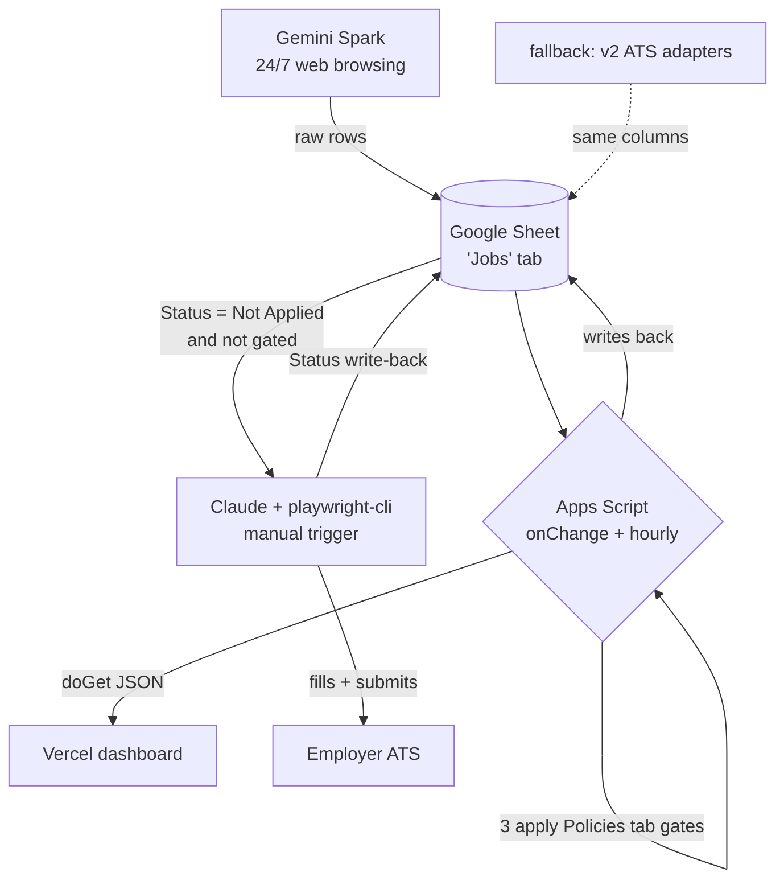

# JobOps v3 — Spark → Sheet → Apply

**Status:** design, not built. Written 2026-09-10, revised same day.
**Subject:** Vinoth M. The agent applies on his behalf.

A rewrite of the job pipeline around **Gemini Spark** as the discovery engine and a
**Google Sheet** as the single source of truth, replacing v2's ATS adapters and Postgres.

---

## 1. Why v3, and what it actually costs

v2 works well at the top of the funnel and not at all at the bottom: discovery pulled
**673 postings across 13 boards with zero failures**, but nothing has ever been applied to,
because neither the orchestrator nor the applier was built.

v3 keeps the goal and changes the machinery.

| | v2 (built) | v3 (this doc) |
|---|---|---|
| Discovery | Greenhouse/Lever JSON adapters | **Gemini Spark**, 24/7 web browsing |
| Enrichment | in the adapter | **ATS public API, per job** (§5.2) |
| Gates | 33 typed policies in markdown | **`Policies` tab, applied in Apps Script** (§3.2) |
| State | Postgres | **Google Sheet** |
| Scheduling | none (orchestrator unbuilt) | Spark schedules + hourly Apps Script |
| Dashboard | Next.js on localhost | Next.js on **Vercel** |
| Applying | none | **Claude + playwright-cli** |

### 1.1 Known limits, and how each is handled

The first draft of this document listed five costs. Three have real fixes; one is fine as
it stands; one is commercial.

| # | Limit | Resolution | Residual cost |
|---|---|---|---|
| 1 | Scraped pages carry no requisition ID | **Fixed** — parse the ID from the apply link, then enrich from the ATS's own public JSON API (§5.2) | none; the JD text you gain is better than scraping |
| 2 | A Sheet has no unique constraint | **Fixed for the failure that happens** — `LockService` mutex around every write (§5.3) | not ACID, but the concurrent-append race is gone |
| 3 | Policies become prose in an agent prompt | **Fixed** — gates live in a `Policies` tab and run in code (§3.2) | none; more editable than v2 |
| 4 | Spark has no API | **Workaround** — Spark schedules itself, and an `onChange` trigger reacts to its writes. The Sheet is the API | can't trigger Spark on demand |
| 5 | Spark needs Google AI Ultra | **Not fixable — commercial.** Fallback: v2's adapters write the same columns into the same Sheet | subscription cost, or a less broad finder |

Limit 5 is why **the discovery layer is deliberately swappable**. Everything downstream
depends on the Sheet contract, not on Spark. Do not delete v2's adapters.

---

## 2. The flow



**In one line:** Spark finds jobs and writes them to a Sheet; Apps Script gives each row a
stable identity, enriches it from the ATS's own API, and runs the gates; Vercel renders the
result; Claude applies to what survives and writes the outcome back.

The Sheet is the only thing all four components share. Every contract here is a column
definition.

---

## 3. Data contract

### 3.1 The `Jobs` tab

One row per job. Indexed **by header name**, so columns may be reordered but not renamed.

| # | Column | Written by | Notes |
|---|---|---|---|
| 1 | **Job ID** | Apps Script | `ats:requisition` or `hash:xxxxxxxxxxxx`. **The dedupe key** |
| 2 | Company Name | Spark | |
| 3 | Role | Spark | Title as posted |
| 4 | Location | Spark → enrichment | City, Country. `NA` if unstated |
| 5 | Salary | Spark → enrichment | As posted, else `NA` — never invented |
| 6 | Apply Link | Spark | Direct link to the posting, not a search page |
| 7 | **ATS** | Apps Script | `greenhouse`/`lever`/`ashby`/`workday`/`smartrecruiters`/`other`. **The applier branches on this** |
| 8 | Job Match | Spark | Score 0–100 plus one line of reasoning |
| 9 | **Gate Result** | Apps Script | `Pass`, or the gate that rejected it — e.g. `requires 5+ years` |
| 10 | **Status** | applier | `Not Applied` → `Applied` / `Blocked` / `Failed` / `Skipped` |
| 11 | Applied At | applier | Timestamp on success |
| 12 | Notes | applier | Blocker text when Status ≠ Applied |
| 13 | JD Text | enrichment | Full description from the ATS API. Feeds matching and form answers |
| 14 | Discovered At | Apps Script | When the row first appeared |

### 3.2 The `Policies` tab

The fix for "no policy engine". Gates live as **data**, and Apps Script applies them
deterministically after enrichment. Editable without touching a prompt or any code.

| key | value | type | active | notes |
|---|---|---|---|---|
| experience_max_years | 3 | hard_gate | yes | reject if the JD floor exceeds this |
| blocked_title_words | senior,staff,principal,manager | hard_gate | yes | |
| country | India | hard_gate | yes | |
| required_title_words | engineer,developer,sde | hard_gate | yes | catches IT-support/service-desk false positives |
| preferred_stack | .net,asp.net,node,react,aws,microservices | ranking | yes | |

Every rejection writes the reason into **Gate Result**, so the dashboard can show which
gate is doing the damage. In v2, the experience gate alone accounted for **65% of all
rejections** and that only became visible after a hand-written SQL query — here it is
visible by default.

### 3.3 Identity

The apply link carries the requisition ID for every major ATS:

```
greenhouse       …greenhouse.io/<co>/jobs/7771208        → greenhouse:7771208
lever            …lever.co/<co>/<uuid>                   → lever:<uuid>
ashby            …ashbyhq.com/<co>/<uuid>                → ashby:<uuid>
smartrecruiters  …smartrecruiters.com/<co>/<id>          → smartrecruiters:<id>
workday          …myworkdayjobs.com/…/JR-12345           → workday:jr-12345
```

Fallback when no ID is present: MD5 of `company|role|location`, normalised to lowercase
alphanumerics, prefixed `hash:` so the two kinds are never confused.

**Reposts still defeat this** — a relisted role gets a new requisition ID and so a new row.
A weekly sweep for the same `company + normalised role` under two IDs catches them. v1 kept
a `§EXCLUSIONS` list for exactly this reason; reposts waste real application slots.

---

## 4. Phase 1 — Discovery (Gemini Spark)

**What it does:** runs continuously, browses job boards and career pages, matches loosely
against Vinoth's criteria, appends candidate rows to the Sheet.

**Configured conversationally** — no code. The whole phase is an instruction.

**Spark should find broadly, not filter tightly.** The gates run in Apps Script where they
are testable and visible. Asking a language model to be the filter is what makes matching
untestable; asking it to be the finder plays to what it is good at.

Criteria seeded from `data/personal.md` and `data/policies/targeting.md`:

- Target band **0–3 years**
- India; Coimbatore/Bangalore/Chennai/Remote preferred
- Backend/full-stack engineering roles
- Stack: .NET Core, ASP.NET Core, Node.js, React, AWS, microservices

**Settle before building:**
- Does Spark genuinely run unattended, or does "checks with you before major actions" block it?
- What cadence does it support?
- How consistent is its column formatting run to run?

---

## 5. Phase 2 — Apps Script

Bound to the Sheet. Reuses the pattern proven in `SheetMailer-Code.gs`.

### 5.1 Identity and dedupe

```javascript
function jobId(applyLink, company, role, location) {
  const url = String(applyLink || '').split(/[?#]/)[0].replace(/\/+$/, '');
  const pats = [
    [/greenhouse\.io\/[^/]+\/jobs\/(\d+)/i,          'greenhouse'],
    [/lever\.co\/[^/]+\/([0-9a-f-]{16,})/i,          'lever'],
    [/ashbyhq\.com\/[^/]+\/([0-9a-f-]{16,})/i,       'ashby'],
    [/smartrecruiters\.com\/[^/]+\/(\d+)/i,          'smartrecruiters'],
    [/myworkdayjobs\.com\/.*?([A-Z]{2,4}-?\d{4,})/i, 'workday'],
  ];
  for (const [re, ats] of pats) {
    const m = url.match(re);
    if (m) return { id: ats + ':' + m[1].toLowerCase(), ats: ats };
  }
  const norm = s => String(s || '').toLowerCase().replace(/[^a-z0-9]+/g, ' ').trim();
  const key = [norm(company), norm(role), norm(location)].join('|');
  const bytes = Utilities.computeDigest(Utilities.DigestAlgorithm.MD5, key);
  const hash = bytes.map(b => (b & 0xff).toString(16).padStart(2, '0')).join('').slice(0, 12);
  return { id: 'hash:' + hash, ats: 'other' };
}
```

Dedupe runs **within the incoming batch as well as against the Sheet** — Spark will hand
you the same job twice in one run. A row whose Status is `Applied` is immutable and can
never be rewritten by a rescrape.

### 5.2 Enrichment — the fix for limit 1

Once the ID and ATS are known, fetch the job from the ATS's **own public JSON API**. Free,
no key, no scraping:

```
greenhouse   boards-api.greenhouse.io/v1/boards/<co>/jobs/<id>
lever        api.lever.co/v0/postings/<co>/<id>
ashby        jobs.ashbyhq.com/api/non-user-graphql  (public board query)
```

Fills **JD Text**, canonical location, posted date, and the true requisition ID. These are
the same endpoints v2's adapters use, so they are already proven against these boards.

Rows whose ATS is `other` skip enrichment and rely on Spark's values.

### 5.3 Locking — the fix for limit 2

```javascript
const lock = LockService.getScriptLock();
lock.waitLock(30000);
try { appendNewJobs(rows); } finally { lock.releaseLock(); }
```

Serialises every write, so the hourly trigger and a Spark write landing at the same moment
can't interleave. Not ACID — but the concurrent-append race is the only one that occurs in
practice.

### 5.4 Gates — the fix for limit 3

Read the `Policies` tab; apply each active `hard_gate` to the enriched row; write `Pass` or
the failing reason into **Gate Result**. Deterministic, unit-testable, and editable from the
spreadsheet.

### 5.5 Triggers and the endpoint

- **`onChange` installable trigger** — reacts to Spark's writes; no polling
- **Hourly trigger** — sweep for un-enriched rows, repost detection, cleanup
- **`doGet`** — serves the Sheet as JSON to the dashboard, token-protected

---

## 6. Phase 3 — Dashboard (Vercel)

Read-only view of the Sheet. No database, no localhost, so it deploys clean.

**Panels:**
- Counts by Status — Not Applied / Applied / Blocked / Failed / Skipped
- **Gate breakdown** — how many rows each gate rejected, largest first
- The funnel: discovered → passed gates → applied
- Table filterable by Status, ATS, company, match score
- Blocked and Failed surfaced first — those need a human

**Source:** the Apps Script `doGet` endpoint, revalidated hourly.

The v2 Next.js dashboard in `apps/dashboard` is reusable — same components, different data
source. Its `Funnel` page already renders exactly this gate breakdown.

---

## 7. Phase 4 — The applier (Claude + playwright-cli)

**Triggered manually.** Reads rows where Status is `Not Applied` **and Gate Result is
`Pass`**, applies, writes the result back.

**Per job:**

1. Read the row; branch on **ATS** to pick the form recipe
2. Open the apply link in the persistent browser profile
3. Snapshot the accessibility tree — never assume page structure
4. Fill from `data/personal.md`. **Never invent a value**: empty, `UNKNOWN`, or
   `approved=no` means park the job and ask
5. Upload the right resume from `data/resumes/` — tailored variant if one exists
   (`p44.pdf` for Project44), else `base.pdf`
6. **Pause for human approval before submit**
7. Write Status, Applied At and Notes back to the Sheet

**Recipes come from v1, not from scratch.** `CLAUDE.md` in the Drive JobHunt folder is
183 KB of per-ATS recipes — Workday, Ashby, Lever, Greenhouse, Oracle HCM, SuccessFactors,
LinkedIn, Amazon, Microsoft, SmartRecruiters, Wellfound, YC — plus the playwright-cli
gotchas that cost real hours to find. Port §5 and §6b verbatim.

### Authentication

**Persistent Playwright profile. No scripted logins.**

```bash
playwright-cli open --persistent --profile "<profile-path>" --headed
playwright-cli resize 1280 1600     # re-run after EVERY tab-new
```

Sign in to each site **once, by hand**; the profile keeps the session and automation
reuses it. Greenhouse, Lever and Ashby need no account at all, which is why they are the
right place to start.

**Scripted Google sign-in is forbidden** — v1 §5 records that it lands on
`/signin/rejected` and burns the session. Passwords are never stored in a file, a prompt,
or a script.

### What always stops the run

CAPTCHA · ID verification · account creation · payment or government-ID fields · any
required field not covered by `personal.md`. These park the job as `Blocked` with the
reason in Notes. They never fail silently and are never guessed around.

---

## 8. Status lifecycle

```
Not Applied ──► Applied     submitted, confirmation seen
            ├─► Blocked     needs a human: CAPTCHA, login, unanswerable field
            ├─► Failed      crashed or timed out — safe to retry
            └─► Skipped     gate rejection, duplicate, or repost
```

`Blocked` and `Failed` are deliberately distinct: one needs a person, the other needs a
retry. Collapsing them loses that.

**Never trust the page about whether you submitted** (v1 §4b). Confirm from a confirmation
screen or the acknowledgement email before writing `Applied`.

---

## 9. What carries over

| From | What | Why |
|---|---|---|
| v1 | `CLAUDE.md` §5 per-ATS recipes | Hard-won, covers 12 ATSs |
| v1 | §6b playwright-cli gotchas | run-code sandbox limits, viewport reset, stale refs |
| v1 | Persistent profile approach | The only login method that works |
| v2 | `packages/adapters` | **Do not delete** — the fallback finder, and the enrichment endpoints |
| v2 | `data/personal.md` | Approved-fact model with source and expiry per field |
| v2 | `data/resumes/*.pdf` | Company-tailored variants already built |
| v2 | `apps/dashboard` + Funnel page | Repointed at the Sheet |
| v2 | `data/policies/targeting.md` | Seeds the `Policies` tab |

---

## 10. Risks

1. **Spark may not run truly unattended.** It "checks with you before taking major
   actions". If it blocks on confirmation, the 24/7 premise fails. **Test this first.**
2. **Format drift.** A conversational agent writing rows will vary. Apps Script must
   validate and quarantine malformed rows rather than trust them.
3. **Reposts.** New requisition ID, same job. Needs the weekly sweep.
4. **Enrichment coverage.** Boards outside the five known ATSs get no JD text, so their
   gate results rest on Spark's summary alone.
5. **Sheet scale.** Fine to a few thousand rows; slow beyond.
6. **Application slots are finite.** Amazon 10 concurrent, Google 3 per 30 days, YC 5 per
   week. Track caps before bulk-applying; v1 tracked them in `§EXCLUSIONS`.

---

## 11. Build order

Each step is testable alone, and the earliest step is the one that can invalidate
everything after it.

| # | Step | Proves |
|---|---|---|
| 1 | Create the Sheet — `Jobs` and `Policies` tabs per §3 | The contract exists |
| 2 | **Configure Spark; watch one overnight run** | Whether Spark is viable at all |
| 3 | Apps Script: `jobId`, `appendNewJobs`, `LockService`, hourly + `onChange` | Dedupe holds under concurrency |
| 4 | Enrichment from the ATS APIs (§5.2) | Real requisition IDs and JD text |
| 5 | Gate evaluation from the `Policies` tab (§5.4) | Matching is testable again |
| 6 | `doGet` + token | Dashboard has a source |
| 7 | Deploy dashboard to Vercel | Visibility |
| 8 | Applier: Greenhouse + Lever only, submit paused for approval | **One real application** |
| 9 | Status write-back | The loop closes |
| 10 | Extend to Ashby, SmartRecruiters | Coverage |
| 11 | Workday, Oracle HCM — sign in by hand once each | The hard ones |

**Step 2 is the gate.** If Spark can't run unattended or its output is too inconsistent to
parse, discovery reverts to v2's adapters and steps 3–11 are unchanged — the Sheet contract
is identical either way.

**Step 8 is the milestone.** v2 has never submitted an application; v1 submitted 52. One
Greenhouse submission end to end is worth more than everything else on this list.
